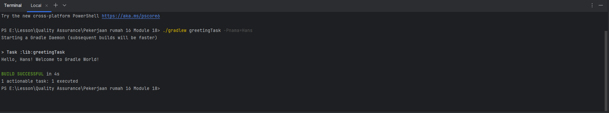

# JayJayGradle

Membuat proyek Gradle baru dengan menjalankan perintah "gradle init --type java-library".

Untuk menjalankan tugas, dengan menjalankan perintah berikut: "./gradlew greetingTask -Pnama=YourName"

